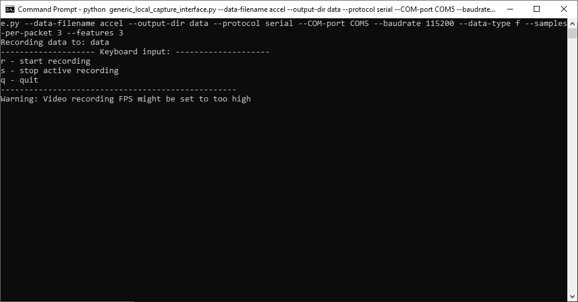

# Machine learning: Imagimob data collection

This code example demonstrates how to collect data using [Imagimob's Capture Server](https://bitbucket.org/imagimob/captureserver/src/master/) to train a model within [Imagimob Studio](https://www.imagimob.com/products). The code example supports collecting data from six different sources: IMU (BMI160/BMX160), digital microphone (PDM-PCM) on the CY8CKIT-062S2-43102 with the sheild, and IMU (BMI270), digital microphone (PDM-PCM), magnetometer (BMM350), pressure sensor (DPS368), and radar sensor (BGT60TR13C) on the CY8CKIT-62S2-AI. The data is transmitted using UART to the capture server, where it stores it as a .data file for IMU or a .wav file for PDM/PCM data. The data can then be used in the Human Activity detection or Baby Crying detection [Imagimob starter projects](https://developer.imagimob.com/getting-started/starter-project) or to generate a new model. To deploy an Imagimob model onto an Infineon embedded device see the [Imagimob MTBML deployment](https://github.com/Infineon/mtb-example-ml-imagimob-mtbml-deploy) and [Imagimob deployment](https://github.com/Infineon/mtb-example-ml-imagimob-deploy) code examples.

[View this README on GitHub.](https://github.com/Infineon/mtb-example-ml-imagimob-data-collection)

[Provide feedback on this code example.](https://cypress.co1.qualtrics.com/jfe/form/SV_1NTns53sK2yiljn?Q_EED=eyJVbmlxdWUgRG9jIElkIjoiQ0UyMjM1NDEiLCJTcGVjIE51bWJlciI6IjAwMi0yMzU0MSIsIkRvYyBUaXRsZSI6IkhBTDogSGVsbG8gd29ybGQiLCJyaWQiOiJraGF0cmluYXZpbmsiLCJEb2MgdmVyc2lvbiI6IjQuNC4wIiwiRG9jIExhbmd1YWdlIjoiRW5nbGlzaCIsIkRvYyBEaXZpc2lvbiI6Ik1DRCIsIkRvYyBCVSI6IklDVyIsIkRvYyBGYW1pbHkiOiJQU09DIn0=)

## Requirements

- [ModusToolbox&trade;](https://www.infineon.com/modustoolbox) v3.1 or later (tested with v3.1)
- Programming language: C
- Associated parts: [PSoC&trade; 62S2 Wi-Fi Bluetooth&reg; Pioneer Kit](https://www.infineon.com/CY8CKIT-062S2-43012) (`CY8CKIT-062S2-43012`) + [IoT Sense Expansion Kit](https://www.infineon.com/cms/en/product/evaluation-boards/cy8ckit-028-sense) and [AIROC&trade; CYW43439 Wi-Fi & Bluetooth&reg; combo chip](https://www.infineon.com/cms/en/product/wireless-connectivity/airoc-wi-fi-plus-bluetooth-combos/wi-fi-4-802.11n/cyw43439)
- PSoC&trade; 6 board support package (BSP) minimum required version: 4.0.0


## Supported toolchains (make variable 'TOOLCHAIN')

- GNU Arm&reg; Embedded Compiler v10.3.1 (`GCC_ARM`) - Default value of `TOOLCHAIN`
- Arm&reg; Compiler v6.16 (`ARM`)
- IAR C/C++ Compiler v9.30.1 (`IAR`)

## Supported kits (make variable 'TARGET')

- [PSoC&trade; 62S2 Wi-Fi Bluetooth&reg; Pioneer Kit](https://www.infineon.com/CY8CKIT-062S2-43012) (`CY8CKIT-062S2-43012`) – Default value of `TARGET`
- [PSoC&trade; 6 AI Evaluation Kit](https://www.infineon.com/CY8CKIT-062S2-AI) (`CY8CKIT-062S2-AI`)

A shield is also required to run this code example. The following shields are supported:
- [IoT Sense Expansion Kit](https://www.infineon.com/cms/en/product/evaluation-boards/cy8ckit-028-sense) (`CY8CKIT-028-SENSE`)
- [TFT Display Shield Board](https://www.infineon.com/cms/en/product/evaluation-boards/cy8ckit-028-tft) (`CY8CKIT-028-TFT`)
- [CY8CKIT-028-EPD](https://www.infineon.com/cms/en/product/evaluation-boards/cy8ckit-028-epd) (`CY8CKIT-028-TFT`)

> **Note:** For the CY8CKIT-062S2-AI, shield is not needed.
>
> BMM350 sensor and Radar sensor Data collection only supported on CY8CKIT-062S2-AI.

## Hardware setup

Connect the CY8CKIT-028-SENSE shield to the baseboard header compatible with Arduino.

The code example also works with the CY8CKIT-028-TFT shield. See the [Operation](#operation) section for more information.

## Software setup

See the [ModusToolbox&trade; tools package installation guide](https://www.infineon.com/ModusToolboxInstallguide) for information about installing and configuring the tools package.

This example requires [Imagimob's Capture Server](https://bitbucket.org/imagimob/captureserver/src/master/README.md). See the "Installation" section in the Capture Server readme to install the tool.

## Using the code example

### Create the project

The ModusToolbox&trade; tools package provides the Project Creator as both a GUI tool and a command line tool.

<details><summary><b>Use Project Creator GUI</b></summary>

1. Open the Project Creator GUI tool.

   There are several ways to do this, including launching it from the dashboard or from inside the Eclipse IDE. For more details, see the [Project Creator user guide](https://www.infineon.com/ModusToolboxProjectCreator) (locally available at *{ModusToolbox&trade; install directory}/tools_{version}/project-creator/docs/project-creator.pdf*).

2. On the **Choose Board Support Package (BSP)** page, select a kit supported by this code example. See [Supported kits](#supported-kits-make-variable-target).

   > **Note:** To use this code example for a kit not listed here, you may need to update the source files. If the kit does not have the required resources, the application may not work.

3. On the **Select Application** page:

   a. Select the **Applications(s) Root Path** and the **Target IDE**.

   > **Note:** Depending on how you open the Project Creator tool, these fields may be pre-selected for you.

   b.	Select this code example from the list by enabling its check box.

   > **Note:** You can narrow the list of displayed examples by typing in the filter box.

   c. (Optional) Change the suggested **New Application Name** and **New BSP Name**.

   d. Click **Create** to complete the application creation process.

</details>

<details><summary><b>Use Project Creator CLI</b></summary>

The 'project-creator-cli' tool can be used to create applications from a CLI terminal or from within batch files or shell scripts. This tool is available in the *{ModusToolbox&trade; install directory}/tools_{version}/project-creator/* directory.

Use a CLI terminal to invoke the 'project-creator-cli' tool. On Windows, use the command-line 'modus-shell' program provided in the ModusToolbox&trade; installation instead of a standard Windows command-line application. This shell provides access to all ModusToolbox&trade; tools. You can access it by typing "modus-shell" in the search box in the Windows menu. In Linux and macOS, you can use any terminal application.

The following example clones the "[mtb-example-ml-imagimob-data-collection](https://github.com/Infineon/mtb-example-ml-imagimob-data-collection)" application with the desired name "ImagimobDataCollection" configured for the *CY8CKIT-062S2-43012* BSP into the specified working directory, *C:/mtb_projects*:

   ```
   project-creator-cli --board-id CY8CKIT-062S2-43012 --app-id mtb-example-ml-imagimob-data-collection --user-app-name ImagimobDataCollection --target-dir "C:/mtb_projects"
   ```


The 'project-creator-cli' tool has the following arguments:

Argument | Description | Required/optional
---------|-------------|-----------
`--board-id` | Defined in the <id> field of the [BSP](https://github.com/Infineon?q=bsp-manifest&type=&language=&sort=) manifest | Required
`--app-id`   | Defined in the <id> field of the [CE](https://github.com/Infineon?q=ce-manifest&type=&language=&sort=) manifest | Required
`--target-dir`| Specify the directory in which the application is to be created if you prefer not to use the default current working directory | Optional
`--user-app-name`| Specify the name of the application if you prefer to have a name other than the example's default name | Optional

> **Note:** The project-creator-cli tool uses the `git clone` and `make getlibs` commands to fetch the repository and import the required libraries. For details, see the "Project creator tools" section of the [ModusToolbox&trade; tools package user guide](https://www.infineon.com/ModusToolboxUserGuide) (locally available at {ModusToolbox&trade; install directory}/docs_{version}/mtb_user_guide.pdf).

</details>


### Open the project

After the project has been created, you can open it in your preferred development environment.


<details><summary><b>Eclipse IDE</b></summary>

If you opened the Project Creator tool from the included Eclipse IDE, the project will open in Eclipse automatically.

For more details, see the [Eclipse IDE for ModusToolbox&trade; user guide](https://www.infineon.com/MTBEclipseIDEUserGuide) (locally available at *{ModusToolbox&trade; install directory}/docs_{version}/mt_ide_user_guide.pdf*).

</details>


<details><summary><b>Visual Studio (VS) Code</b></summary>

Launch VS Code manually, and then open the generated *{project-name}.code-workspace* file located in the project directory.

For more details, see the [Visual Studio Code for ModusToolbox&trade; user guide](https://www.infineon.com/MTBVSCodeUserGuide) (locally available at *{ModusToolbox&trade; install directory}/docs_{version}/mt_vscode_user_guide.pdf*).

</details>


<details><summary><b>Keil µVision</b></summary>

Double-click the generated *{project-name}.cprj* file to launch the Keil µVision IDE.

For more details, see the [Keil µVision for ModusToolbox&trade; user guide](https://www.infineon.com/MTBuVisionUserGuide) (locally available at *{ModusToolbox&trade; install directory}/docs_{version}/mt_uvision_user_guide.pdf*).

</details>


<details><summary><b>IAR Embedded Workbench</b></summary>

Open IAR Embedded Workbench manually, and create a new project. Then select the generated *{project-name}.ipcf* file located in the project directory.

For more details, see the [IAR Embedded Workbench for ModusToolbox&trade; user guide](https://www.infineon.com/MTBIARUserGuide) (locally available at *{ModusToolbox&trade; install directory}/docs_{version}/mt_iar_user_guide.pdf*).

</details>


<details><summary><b>Command line</b></summary>

If you prefer to use the CLI, open the appropriate terminal, and navigate to the project directory. On Windows, use the command-line 'modus-shell' program; on Linux and macOS, you can use any terminal application. From there, you can run various `make` commands.

For more details, see the [ModusToolbox&trade; tools package user guide](https://www.infineon.com/ModusToolboxUserGuide) (locally available at *{ModusToolbox&trade; install directory}/docs_{version}/mtb_user_guide.pdf*).

</details>


## Operation

1. Connect the board to your PC using the provided USB cable through the KitProg3 USB connector. TThe example is set up to use the CY8CKIT-062S2-AI.

   If you are using the CY8CKIT-062S2-43012, update the `SHIELD_DATA_COLLECTION` variable corresponding to `APP_CY8CKIT-062S2-43012` in the *Makefile*.
   
   - if using the CY8CKIT-028-TFT shield, change to `SHIELD_DATA_COLLECTION=TFT_SHIELD` in the Makefile.
   - if using the CY8CKIT-028-EPD shield, change to `SHIELD_DATA_COLLECTION=EPD_SHIELD` in the Makefile.
   - if using the CY8CKIT-028-SENSE shield, selection depends on kit version:

   To check the version of CY8CKIT-028-SENSE, locate the sticker on the bottom of the shield's box which indicates the revision.

   - If the shield is Rev "**" or "*A", use `SHIELD_DATA_COLLECTION=SENSE_SHIELD`.
   - If the shield is Rev "*B" or later, use `SHIELD_DATA_COLLECTION=SENSE_SHIELD_v2`.

2. Program the board using one of the following:

   <details><summary><b>Using Eclipse IDE</b></summary>

      1. Select the application project in the Project Explorer.

      2. In the **Quick Panel**, scroll down, and click **\<Application Name> Program (KitProg3_MiniProg4)**.
   </details>


   <details><summary><b>In other IDEs</b></summary>

   Follow the instructions in your preferred IDE.
   </details>


   <details><summary><b>Using CLI</b></summary>

     From the terminal, execute the `make program` command to build and program the application using the default toolchain to the default target. The default toolchain is specified in the application's Makefile but you can override this value manually:
      ```
      make program TOOLCHAIN=<toolchain>
      ```

      Example:
      ```
      make program TOOLCHAIN=GCC_ARM
      ```
   </details>

3. The code example is configured out of the box to stream IMU data over UART. After programming, the application starts automatically sending IMU data.

4. Open a command prompt and change to the following directory *{Imagimob Capture Server cloned repo}/captureserver/examples/generic*.

5. While the device is connected to the PC, run the following command in the command prompt after changing the 'xxx' to the COM port used by the developer kit.

`python generic_local_capture_interface.py --data-filename accel --output-dir data --protocol serial --COM-port COMxxx --baudrate 115200 --data-type f --samples-per-packet 3 --features 3`

6. When collecting IMU data, the capture server will collect video for easy labeling in Imagimob Studio. Wait for the video stream to come up (this may take up to 10 seconds). Prints the following message on the screen:

   **Figure 1. Capture Server options**

   

7. Press the on kit "USER BTN1" to trigger the device to start transmitting data, this is done to sync the capture server. Each time the command from Step 5 is run, reset the kit and press "USER BTN1" after the command is run.

8. Press 'r' to start collecting IMU data.

9. After the IMU data collection is complete, press 's' to stop collecting data. 

10. Repeat steps 8 and 9 multiple times to generate multiple data files. After all the data collection is complete, press 'q' to quit the streamer.

11. All the data is stored in the following directory *{Imagimob Capture Server cloned repo}/captureserver/examples/generic/data*. Each sample is stored in a folder with a date and time stamp, the folder includes the captured data as a .data file.

12. The code example supports collecting PDM/PCM data. To configure the application to collect PDM/PCM data open *source/config.h* and set `INFERENCE_MODE_SELECT = PDM_COLLECTION`.

13. Program the device as outlined in Step 4.

14. Open a command prompt and change to the following directory *{Imagimob Capture Server cloned repo}/captureserver/examples/generic*.

15. While the device is connected to the PC, run the following command in the command prompt after changing the 'xxx' to the COM port used by the developer kit. Note that the video is disabled and should not be used while collecting audio data.

`python generic_local_capture_interface.py --output-dir data --protocol serial --COM-port COMxxx --baudrate 1000000 --data-format .wav --data-type h --samples-per-packet 1024 --features 1 --sample-rate 16000 --video-disabled`

16. Wait for the message seen in Figure 1 to come up. For PDM/PCM data, the video streamer is disabled.

17. Press "USER BTN1" on the kit to trigger the device to start transmitting data, this is done to sync the capture server. Each time the command from Step 15 is run, reset the kit and press "USER BTN1" after the command is run.

18. Press 'r' to start collecting audio data.

19. After the audio data collection is complete, press 's' to stop collecting data. 

20. Repeat steps 18 and 19 multiple times to generate multiple data files. After all the data collection is complete, press 'q' to quit the streamer.

21. All the data is stored in the following directory *{Imagimob Capture Server cloned repo}/captureserver/examples/generic/data*. Each sample is stored in a folder with a date and time stamp, the folder includes the captured data as a .wav file.

22. The code example supports collecting Magnetometer data. To configure the application to collect Magnetometer data open source/config.h and set `INFERENCE_MODE_SELECT = BMM_COLLECTION`.
> **Note:** Magnetometer data collection is supported only on CY8CKIT-062S2-AI Kit.
23. Open a command prompt and change to the following directory *{Imagimob Capture Server cloned repo}/captureserver/examples/generic*.

24. While the device is connected to the PC, run the following command in the command prompt after changing the 'xxx' to the COM port used by the developer kit.

`python generic_local_capture_interface.py --data-filename magneto --output-dir data --protocol serial --COM-port COMxxx --baudrate 115200 --data-type f --samples-per-packet 3 --features 3`

25. When collecting BMM data, the capture server will collect video for easy labeling in Imagimob Studio. Wait for the video stream to come up (this may take up to 10 seconds). Prints the following message on the screen:

   **Figure 1. Capture Server options**

   

26. Press the on kit "USER BTN1" to trigger the device to start transmitting data, this is done to sync the capture server. Each time the command from Step 5 is run, reset the kit and press "USER BTN1" after the command is run.

27. Press 'r' to start collecting Magnetometer data.

28. After the Magnetometer data collection is complete, press 's' to stop collecting data. 

29. Repeat steps 8 and 9 multiple times to generate multiple data files. After all the data collection is complete, press 'q' to quit the streamer.

30. All the data is stored in the following directory *{Imagimob Capture Server cloned repo}/captureserver/examples/generic/data*. Each sample is stored in a folder with a date and time stamp, the folder includes the captured data as a .data file.

31. The code example supports collecting Pressure and temprature data. To configure the application to collect Pressure and temprature data open source/config.h and set `INFERENCE_MODE_SELECT = DPS_COLLECTION`.

32. Open a command prompt and change to the following directory *{Imagimob Capture Server cloned repo}/captureserver/examples/generic*.

33. While the device is connected to the PC, run the following command in the command prompt after changing the 'xxx' to the COM port used by the developer kit.

`python generic_local_capture_interface.py --data-filename Pressure --output-dir data --protocol serial --COM-port COMxxx --baudrate 1000000 --data-type f --samples-per-packet 2 --features 2 --video-disabled`

34. Press the on kit "USER BTN1" to trigger the device to start transmitting data, this is done to sync the capture server. Each time the command from Step 5 is run, reset the kit and press "USER BTN1" after the command is run.

35. Press 'r' to start collecting Pressure and temparature data.

36. After the Pressure and Temparature data collection is complete, press 's' to stop collecting data. 

37. Repeat steps 8 and 9 multiple times to generate multiple data files. After all the data collection is complete, press 'q' to quit the streamer.

38. All the data is stored in the following directory *{Imagimob Capture Server cloned repo}/captureserver/examples/generic/data*. Each sample is stored in a folder with a date and time stamp, the folder includes the captured data as a .data file.

39. The code example supports collecting Radar data. To configure the application to collect Radar data open source/config.h and set `INFERENCE_MODE_SELECT = RADAR_COLLECTION`.
> **Note:** radar data collection is supported only on CY8CKIT-062S2-AI Kit
40. Open a command prompt and change to the following directory *{Imagimob Capture Server cloned repo}/captureserver/examples/generic*.

41. While the device is connected to the PC, run the following command in the command prompt after changing the 'xxx' to the COM port used by the developer kit.

`python generic_local_capture_interface.py --data-filename radar --output-dir data --protocol serial --COM-port COMxxx --baudrate 1000000 --data-type h --samples-per-packet 128 --features 1 --video-disabled`

42. Press the on kit "USER BTN1" to trigger the device to start transmitting data, this is done to sync the capture server. Each time the command from Step 5 is run, reset the kit and press "USER BTN1" after the command is run.

43. Press 'r' to start collecting Radar data.

44. After Radar data collection is complete, press 's' to stop collecting data. 

45. Repeat steps 8 and 9 multiple times to generate multiple data files. After all the data collection is complete, press 'q' to quit the streamer.

46. All the data is stored in the following directory *{Imagimob Capture Server cloned repo}/captureserver/examples/generic/data*. Each sample is stored in a folder with a date and time stamp, the folder includes the captured data as a .data file.

31. Import the data into the Imagimob Studio. For more information, see the Imagimob's [Bring your own data](https://developer.imagimob.com/data-importing) documentation.

## Debugging


You can debug the example to step through the code.


<details><summary><b>In Eclipse IDE</b></summary>

Use the **\<Application Name> Debug (KitProg3_MiniProg4)** configuration in the **Quick Panel**. For details, see the "Program and debug" section in the [Eclipse IDE for ModusToolbox&trade; user guide](https://www.infineon.com/MTBEclipseIDEUserGuide).

> **Note:** **(Only while debugging)** On the CM4 CPU, some code in `main()` may execute before the debugger halts at the beginning of `main()`. This means that some code executes twice – once before the debugger stops execution, and again after the debugger resets the program counter to the beginning of `main()`. See [KBA231071](https://community.infineon.com/docs/DOC-21143) to learn about this and for the workaround.

</details>


<details><summary><b>In other IDEs</b></summary>

Follow the instructions in your preferred IDE.
</details>


## Design and implementation

This code example allows collecting data from one of this sensors - IMU, PDM/PCM, magnetometer, pressure sensor, radar sensor using the [Imagimob's Capture Server](https://bitbucket.org/imagimob/captureserver/src/master/). The application supports transmitting data over UART to the Capture Server.

### IMU capture

The code example is designed to collect data from a motion sensor (BMX160/BMI160/BMI270). The data consists of the 3-axis accelerometer data obtained from the motion sensor. A timer is configured to interrupt at 50 Hz to sample the motion sensor. The interrupt handler reads all data from the sensor via I2C or SPI, the data is then transmitted over UART. The Capture Server collects this data and stores it in a .data file along with a video file that can both be imported into Imagimob Studio.

### PDM/PCM capture
The code example can be configured to collect pulse density modulation to pulse code modulation audio data. The PDM/PCM is sampled at 16 kHz and an interrupt is generated after 1024 samples are collected. After collecting 1024 samples, the data is then transmitted over UART.

### MAGNETOMETER capture
The code example can be configured to collect data from magnetometer sensor (BMM350). The data consists of the 3-axis magnetometer data obtained from the magnetometer (BMM350) sensor. A timer is configured to interrupt at 50 Hz to sample the magnetometer (BMM350) sensor. The interrupt handler reads all data from the sensor via I2C, the data is then transmitted over UART.

### PRESSURE capture
The code example can be configured to collect data from Pressure sensor (DPS368). A timer is configured to interrupt at 50 Hz to sample the Pressure sensor. The interrupt handler reads all data from the sensor via I2C, the data is then transmitted over UART.

### RADAR capture
The code example can be configured to collect data from Radar sensor (BGT60TR13C). A timer is configured to interrupt at 50 Hz to sample the Radar sensor. The interrupt handler reads all data from the sensor via SPI, the data is then transmitted over UART.

### Files and folders

```
|-- source                 # Contains the source code files for this example.
   |- audio.c/h            # Implements the PDM to collect data.
   |- imu.c/h              # Implements the IMU to collect data.
   |- config.h             # Configures the application for either PDM or IMU collection.
   |- streaming.c/h        # Configures the application for streaming over UART.
|-- mtb_data_stream        # Contains the source code for streaming over UART.
```

<br>


### Resources and settings

**Table 1. Application resources**

 Resource  |  Alias/object     |    Purpose
 :-------- | :-------------    | :------------
 UART (HAL)|cy_retarget_io_uart_obj| UART HAL object used by Retarget-IO for the Debug UART port
 Timer    | imu_timer     | Timer HAL object used to periodically read from the IMU
 I2C (HAL) | i2c | I2C HAL object used to communicate with the IMU sensor (used for the CY8CKIT-028-TFT shield)
 SPI (HAL) | spi | SPI HAL object used to communicate with the IMU sensor (used for the CY8CKIT-028-SENSE shield)
 PDM_PCM | pdm_pcm | PDM HAL object used to interact with the shields PDM sensors

<br>


## Related resources


Resources  | Links
-----------|----------------------------------
Application notes  | [AN228571](https://www.infineon.com/AN228571) – Getting started with PSoC&trade; 6 MCU on ModusToolbox&trade; <br>  [AN215656](https://www.infineon.com/AN215656) – PSoC&trade; 6 MCU: Dual-CPU system design
Code examples  | [Using ModusToolbox&trade;](https://github.com/Infineon/Code-Examples-for-ModusToolbox-Software) on GitHub
Device documentation | [PSoC&trade; 6 MCU datasheets](https://documentation.infineon.com/html/psoc6/bnm1651211483724.html) <br> [PSoC&trade; 6 technical reference manuals](https://documentation.infineon.com/html/psoc6/zrs1651212645947.html)
Development kits | Select your kits from the [Evaluation board finder](https://www.infineon.com/cms/en/design-support/finder-selection-tools/product-finder/evaluation-board).
Libraries on GitHub  | [mtb-pdl-cat1](https://github.com/Infineon/mtb-pdl-cat1) – PSoC&trade; 6 Peripheral Driver Library (PDL)  <br> [mtb-hal-cat1](https://github.com/Infineon/mtb-hal-cat1) – Hardware Abstraction Layer (HAL) library <br> [retarget-io](https://github.com/Infineon/retarget-io) – Utility library to retarget STDIO messages to a UART port
Middleware on GitHub  | [psoc6-middleware](https://github.com/Infineon/modustoolbox-software#psoc-6-middleware-libraries) – Links to all PSoC&trade; 6 MCU middleware
Tools  | [ModusToolbox&trade;](https://www.infineon.com/modustoolbox) – ModusToolbox&trade; software is a collection of easy-to-use libraries and tools enabling rapid development with Infineon MCUs for applications ranging from wireless and cloud-connected systems, edge AI/ML, embedded sense and control, to wired USB connectivity using PSoC&trade; Industrial/IoT MCUs, AIROC&trade; Wi-Fi and Bluetooth&reg; connectivity devices, XMC&trade; Industrial MCUs, and EZ-USB&trade;/EZ-PD&trade; wired connectivity controllers. ModusToolbox&trade; incorporates a comprehensive set of BSPs, HAL, libraries, configuration tools, and provides support for industry-standard IDEs to fast-track your embedded application development.

<br>

## Other resources


Infineon provides a wealth of data at [www.infineon.com](https://www.infineon.com) to help you select the right device, and quickly and effectively integrate it into your design.


## Document history


Document title: *CE238470* - *Machine learning: Imagimob data collection*

 Version | Description of change
 ------- | ---------------------
 1.0.0   | New code example
 1.1.0   | Added Support for CY8CKIT-062S2-AI
<br>


All referenced product or service names and trademarks are the property of their respective owners.

The Bluetooth&reg; word mark and logos are registered trademarks owned by Bluetooth SIG, Inc., and any use of such marks by Infineon is under license.


---------------------------------------------------------

© Cypress Semiconductor Corporation, 2024. This document is the property of Cypress Semiconductor Corporation, an Infineon Technologies company, and its affiliates ("Cypress").  This document, including any software or firmware included or referenced in this document ("Software"), is owned by Cypress under the intellectual property laws and treaties of the United States and other countries worldwide.  Cypress reserves all rights under such laws and treaties and does not, except as specifically stated in this paragraph, grant any license under its patents, copyrights, trademarks, or other intellectual property rights.  If the Software is not accompanied by a license agreement and you do not otherwise have a written agreement with Cypress governing the use of the Software, then Cypress hereby grants you a personal, non-exclusive, nontransferable license (without the right to sublicense) (1) under its copyright rights in the Software (a) for Software provided in source code form, to modify and reproduce the Software solely for use with Cypress hardware products, only internally within your organization, and (b) to distribute the Software in binary code form externally to end users (either directly or indirectly through resellers and distributors), solely for use on Cypress hardware product units, and (2) under those claims of Cypress's patents that are infringed by the Software (as provided by Cypress, unmodified) to make, use, distribute, and import the Software solely for use with Cypress hardware products.  Any other use, reproduction, modification, translation, or compilation of the Software is prohibited.
<br>
TO THE EXTENT PERMITTED BY APPLICABLE LAW, CYPRESS MAKES NO WARRANTY OF ANY KIND, EXPRESS OR IMPLIED, WITH REGARD TO THIS DOCUMENT OR ANY SOFTWARE OR ACCOMPANYING HARDWARE, INCLUDING, BUT NOT LIMITED TO, THE IMPLIED WARRANTIES OF MERCHANTABILITY AND FITNESS FOR A PARTICULAR PURPOSE.  No computing device can be absolutely secure.  Therefore, despite security measures implemented in Cypress hardware or software products, Cypress shall have no liability arising out of any security breach, such as unauthorized access to or use of a Cypress product. CYPRESS DOES NOT REPRESENT, WARRANT, OR GUARANTEE THAT CYPRESS PRODUCTS, OR SYSTEMS CREATED USING CYPRESS PRODUCTS, WILL BE FREE FROM CORRUPTION, ATTACK, VIRUSES, INTERFERENCE, HACKING, DATA LOSS OR THEFT, OR OTHER SECURITY INTRUSION (collectively, "Security Breach").  Cypress disclaims any liability relating to any Security Breach, and you shall and hereby do release Cypress from any claim, damage, or other liability arising from any Security Breach.  In addition, the products described in these materials may contain design defects or errors known as errata which may cause the product to deviate from published specifications. To the extent permitted by applicable law, Cypress reserves the right to make changes to this document without further notice. Cypress does not assume any liability arising out of the application or use of any product or circuit described in this document. Any information provided in this document, including any sample design information or programming code, is provided only for reference purposes.  It is the responsibility of the user of this document to properly design, program, and test the functionality and safety of any application made of this information and any resulting product.  "High-Risk Device" means any device or system whose failure could cause personal injury, death, or property damage.  Examples of High-Risk Devices are weapons, nuclear installations, surgical implants, and other medical devices.  "Critical Component" means any component of a High-Risk Device whose failure to perform can be reasonably expected to cause, directly or indirectly, the failure of the High-Risk Device, or to affect its safety or effectiveness.  Cypress is not liable, in whole or in part, and you shall and hereby do release Cypress from any claim, damage, or other liability arising from any use of a Cypress product as a Critical Component in a High-Risk Device. You shall indemnify and hold Cypress, including its affiliates, and its directors, officers, employees, agents, distributors, and assigns harmless from and against all claims, costs, damages, and expenses, arising out of any claim, including claims for product liability, personal injury or death, or property damage arising from any use of a Cypress product as a Critical Component in a High-Risk Device. Cypress products are not intended or authorized for use as a Critical Component in any High-Risk Device except to the limited extent that (i) Cypress's published data sheet for the product explicitly states Cypress has qualified the product for use in a specific High-Risk Device, or (ii) Cypress has given you advance written authorization to use the product as a Critical Component in the specific High-Risk Device and you have signed a separate indemnification agreement.
<br>
Cypress, the Cypress logo, and combinations thereof, ModusToolbox, PSoC, CAPSENSE, EZ-USB, F-RAM, and TRAVEO are trademarks or registered trademarks of Cypress or a subsidiary of Cypress in the United States or in other countries. For a more complete list of Cypress trademarks, visit www.infineon.com. Other names and brands may be claimed as property of their respective owners.
